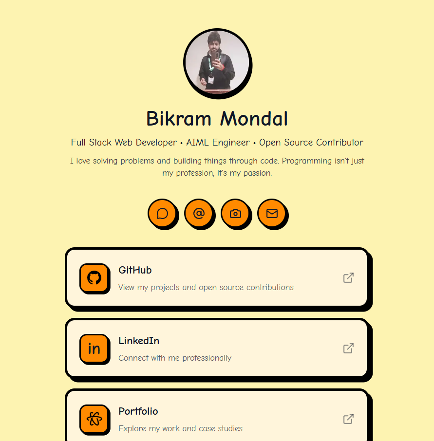

# 🌟🔗 MyLinkTree — A personalized link hub for your digital presence.

<p align="center">
  
  
  
  
</p>



A playful, responsive personal LinkTree built with Next.js. It brings together my GitHub, LinkedIn, portfolio, resume, coding profiles, and social links in one clean page with animated cards, bold shadows, and a warm profile-first layout. ✨

## 🌟 Features

- 👤 Profile-first landing page with avatar, headline, and short bio
- 🔗 Quick-access cards for GitHub, LinkedIn, Portfolio, Resume, GeeksforGeeks, LeetCode, and Kaggle
- 🖼️ Optimized images with Next.js image handling
- 🎬 Smooth hover and entrance animations powered by Framer Motion
- 📱 Responsive layout that works neatly on mobile and desktop
- 🎨 Bold, friendly visual style with rounded cards and comic-inspired typography

## 🛠️ Technologies Used

- ⚡ Next.js 16 - React framework and app routing
- ⚛️ React 19 - Component-based UI
- 🎨 Tailwind CSS 4 - Utility-first styling
- 🎞️ Framer Motion - Page and card animations
- 🧩 Lucide React - Social and action icons
- 🧠 TypeScript - Type-safe component data
- ✅ ESLint - Code quality checks

## ⚙️ Installation

1. Clone the repository:

```bash
git clone https://github.com/BikramMondal5/myLinkTree.git
```

2. Navigate to the project directory:

```bash
cd myLinkTree
```

3. Install dependencies:

```bash
npm install
```

4. Run the development server:

```bash
npm run dev
```

5. Open your browser and visit:

```bash
http://localhost:3000
```

## 🚀 How to Use

- 🧭 Open the homepage to view the full profile link hub.
- 🖱️ Click any link card to visit the connected profile or document.
- 📄 Use the Resume card to open the Google Drive resume.
- 💻 Update links, descriptions, or logo data from `app/page.tsx`.
- 🎨 Adjust global typography and theme styles from `app/globals.css`.

## 🤝 Contribution

Found a bug or have an idea? Contributions are welcome.

- 🍴 Fork the repository
- 🌿 Create a new branch
- 🛠️ Make your changes
- ✅ Run `npm run lint`
- 🚀 Open a pull request

## 📜 License

This project is licensed under the `MIT License`.
